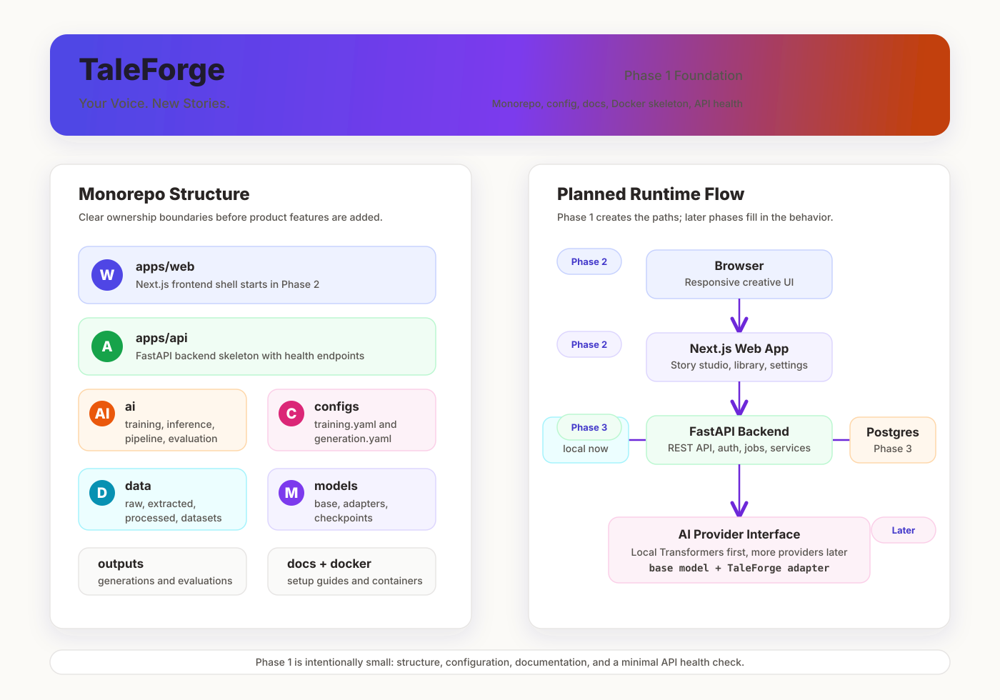

# TaleForge Phase 1 Plan



## Environment Findings

| Check | Result |
| --- | --- |
| Workspace | `C:\my-github\TaleForge` |
| Existing project | No files detected |
| Git repository | Initially not initialized; initialized during Phase 1 |
| Operating system | Microsoft Windows NT 10.0.26200.0 |
| PowerShell | 5.1.26100.9444 |
| Node.js | v24.11.1 |
| npm | 11.6.2 |
| Python | 3.14.0 |
| Git | 2.52.0.windows.1 |
| GPU | NVIDIA GeForce GTX 1650, 4 GB VRAM |

## Phase 1 Scope

Phase 1 creates only the foundation:

- Monorepo folder layout.
- Root package configuration for future workspaces.
- Minimal Python backend package skeleton.
- Minimal Next.js frontend placeholder package metadata.
- Shared configuration placeholders.
- Docker Compose foundation for PostgreSQL, API, and web services.
- Starter documentation explaining the architecture and development flow.

Phase 1 does not implement:

- AI training.
- Model inference.
- Full authentication.
- Database migrations.
- Frontend UI screens.
- Upload/extraction pipelines.

## Proposed Architecture

```text
TaleForge
|
+-- apps
|   |
|   +-- web                 Next.js App Router frontend
|   |   +-- app             Routes and layouts, starting in Phase 2
|   |   +-- components      Reusable UI, feature components
|   |   +-- lib             API clients, utilities, config
|   |
|   +-- api                 FastAPI backend
|       +-- app
|           +-- api         Versioned REST endpoints
|           +-- core        Settings, security, logging
|           +-- db          SQLAlchemy and Alembic integration
|           +-- models      Database models
|           +-- schemas     Pydantic schemas
|           +-- services    Business logic
|
+-- ai
|   +-- training            LoRA/QLoRA training scripts later
|   +-- inference           Provider abstraction later
|   +-- data_pipeline       Extraction, cleaning, validation later
|   +-- evaluation          Style/originality evaluation later
|
+-- configs                 Training and generation YAML config
+-- data                    Raw, extracted, processed, datasets, manifests
+-- models                  Base models, adapters, checkpoints
+-- outputs                 Generations and evaluations
+-- docs                    Beginner-friendly project documentation
+-- docker                  Dockerfiles and runtime support
```

## Runtime Flow Target

```text
Browser
   |
   v
Next.js Web App
   |
   v
FastAPI Backend
   |
   +---- PostgreSQL
   |
   +---- Local File Storage
   |
   +---- AI Provider Interface
             |
             +---- Local Transformers Provider
             +---- Future Ollama / vLLM / external providers
```

## Phase 1 Implementation Steps

1. Initialize Git only if no repository exists.
2. Create the monorepo directories.
3. Add root metadata and workspace scripts.
4. Add `.gitignore` and `.env.example`.
5. Add minimal backend dependency files and package markers.
6. Add minimal frontend package metadata.
7. Add base YAML config files for training and generation defaults.
8. Add Docker Compose foundation.
9. Add beginner-friendly documentation stubs.
10. Verify structure with directory listing and config checks.

## Notes

- Python 3.14 is very new. Some ML libraries may lag behind it, so later phases should likely use Python 3.11 or 3.12 for AI and backend virtual environments.
- GTX 1650 with 4 GB VRAM is useful for light local inference experiments, but LoRA/QLoRA training for modern LLMs will likely require Colab T4 or another larger GPU target.
- No existing code was found, so this phase can safely initialize the project from scratch.
